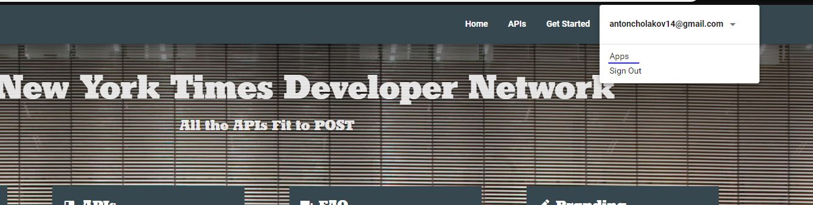

This project is a sample application for fetching most popular articles from "New York Times" API and was bootstrapped with [Create React App](https://github.com/facebook/create-react-app).

## Demo
Working demo of the application is hosted on [https://nytimes-client.herokuapp.com](https://nytimes-client.herokuapp.com).
Please wait if loading takes much time - this means that no one has visited the application soon so the server has to be restarted.

## List view


## Details view


## Details view


## How to run it

Clone the repository:
```bash
# Using SSH
git clone git@github.com:AntonCholakov/nytimes-client.git
# Using HTTPS
git clone https://github.com/AntonCholakov/nytimes-client.git
```

Change directory
```bash
cd nytimes-client
```

Install the dependencies listed in `package.json`:
```bash
# Using NPM
npm install
# Using Yarn
yarn
```

Generate new NY Times API key by following the steps at the end of the README file and use it as expected there.

Start the project
```bash
npm start
```
Runs the app in the development mode.<br>
Open [http://localhost:3000](http://localhost:3000) to view it in the browser.

The page will reload if you make edits.<br>
You will also see any lint errors in the console.

## Tests

```bash
npm test
```

Launches the test runner in the interactive watch mode.<br>
See the section about [running tests](https://facebook.github.io/create-react-app/docs/running-tests) for more information.

```bash
npm run test-all
```

Launches the test runner and executes all unit tests

## Coverage Reports

```bash
npm run coverage
```

Launches the test runner and generates coverage reports displaying it in the terminal and generating one in `coverage` folder.

## New York Times Most Popular API Consumer
This application is a sample consumer of the "New York Times" "Most Popular Articles" API. It uses a client key which is stored under the key `API_KEY` in `AppConstants.js` in the `src` folder.

In order to generate API key you should follow the following steps:
 * Open [https://developer.nytimes.com/](https://developer.nytimes.com/)
 
 * Click `Sign In` and create a developer account
 * Confirm your account using the email you should have received
 * Sign in
 * Select `My Apps` from the user drop-down
 
 * Add new application by clicking `+ New App`
 * Enter a name and description and click `Create`
 * Click the APIs tab and enable the APIs you want to access
 * Select My Apps from the user drop-down
 
 * Choose an application you want to use
 * View your API keys under `API Keys` section or generate a new one
  
 * Use you API key as a query parameter in all request against NY Times API
